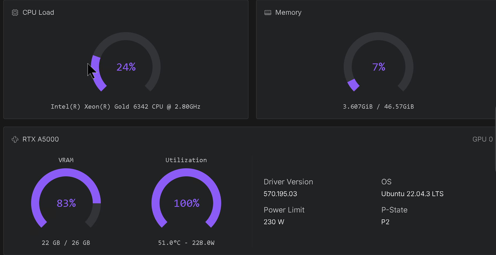

[](https://hub.docker.com/r/ls250824/run-comfyui-image)

# 🚀 Run image with ComfyUI with provisioning RunPod

A streamlined and automated environment for running **ComfyUI** with **image models**, optimized for use on RunPod

## Running Z-Image Turbo



## 🔧 Features

- Automatic model and LoRA downloads via environment variables.
- Built-in **authentication** for:
  - ComfyUI
  - Code Server
  - Hugging Face API
  - CivitAI API
- Supports advanced workflows for **image generation** and **enhancement** using pre-installed custom nodes.
- Compatible with high-performance NVIDIA GPUs.

## 🧩 Template Deployment

### Deployment

- All available templates on runpod are tested on a RTX A4500/A40.

### Runpod templates

- 👉 [Runpod Z-Image Turbo](https://console.runpod.io/deploy?template=ia5t70hfak&ref=se4tkc5o)
- 👉 [Runpod Flux.2 Dev](https://console.runpod.io/deploy?template=8nl523gts5&ref=se4tkc5o)

### Documenation

- [Documentation](https://awesome-comfyui.rozenlaan.site/ComfyUI_image/)
- [Provisioning](docs/ComfyUI_image_provisioning.md)
- [Setup](documentation/README_docker_runpod.md)

## 🐳 Docker Images

### Base Images

- **PyTorch Runtime**  [](https://hub.docker.com/r/ls250824/pytorch-cuda-ubuntu-runtime)

- **ComfyUI Runtime**  [](https://hub.docker.com/r/ls250824/comfyui-runtime)

### Custom Image

docker pull ls250824/run-comfyui-image:<[](https://hub.docker.com/r/ls250824/run-comfyui-image)>

## 🛠️ Build & Push Docker Image (Optional)

Use none docker setup to build the image using the included Python script.

### Build Script: `build-docker.py`

| Argument       | Description                        | Default          |
|----------------|------------------------------------|------------------|
| `--username`   | Your Docker Hub username           | Current user     |
| `--tag`        | Custom image tag                   | Today's date     |
| `--latest`     | Also tag image as `latest`         | Disabled         |

### Example Usage

```bash
git clone https://github.com/jalberty2018/run-comfyui-image.git
cp ./run-comfyui-image/build-docker.py ..

export DOCKER_BUILDKIT=1
export COMPOSE_DOCKER_CLI_BUILD=1

python3 build-docker.py   --username=<your_dockerhub_username>   --tag=<custom_tag>   --latest   run-comfyui-wan
```